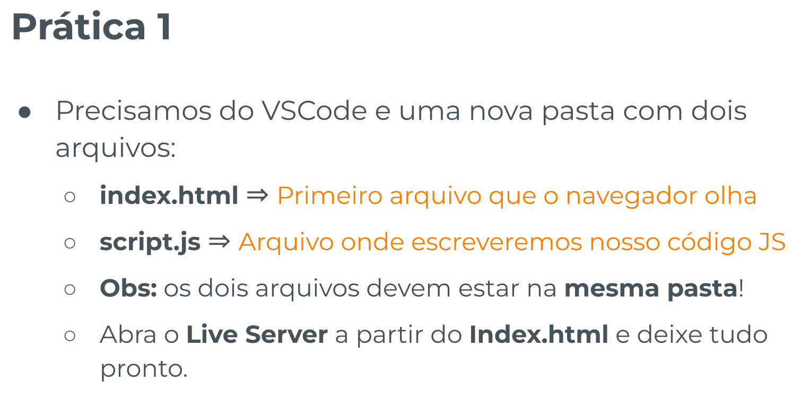
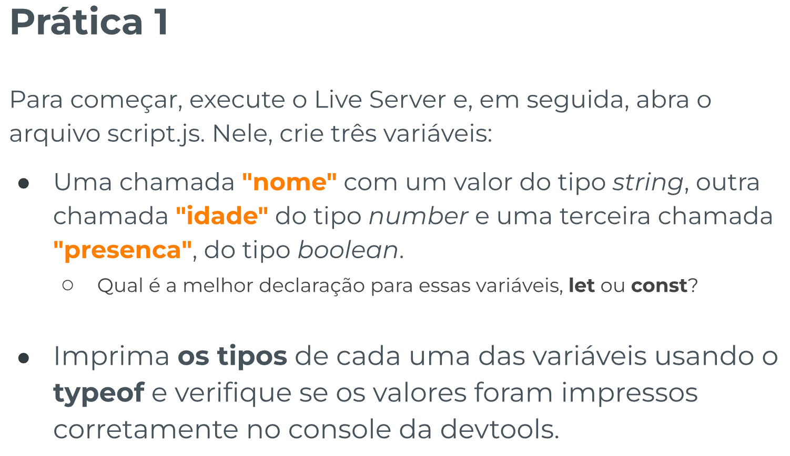
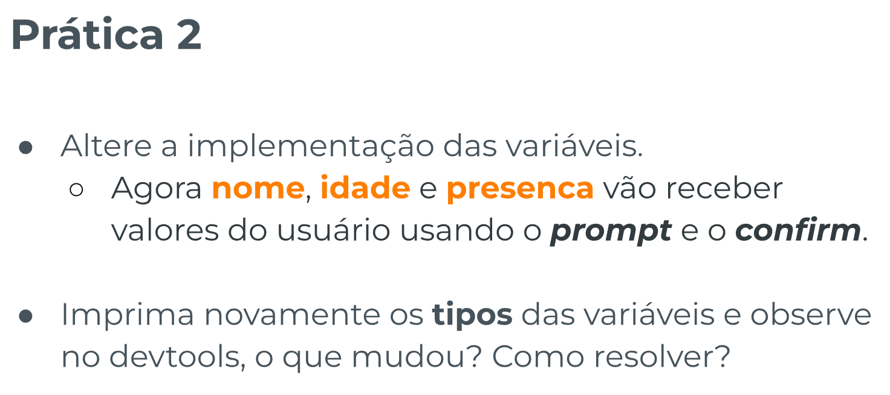
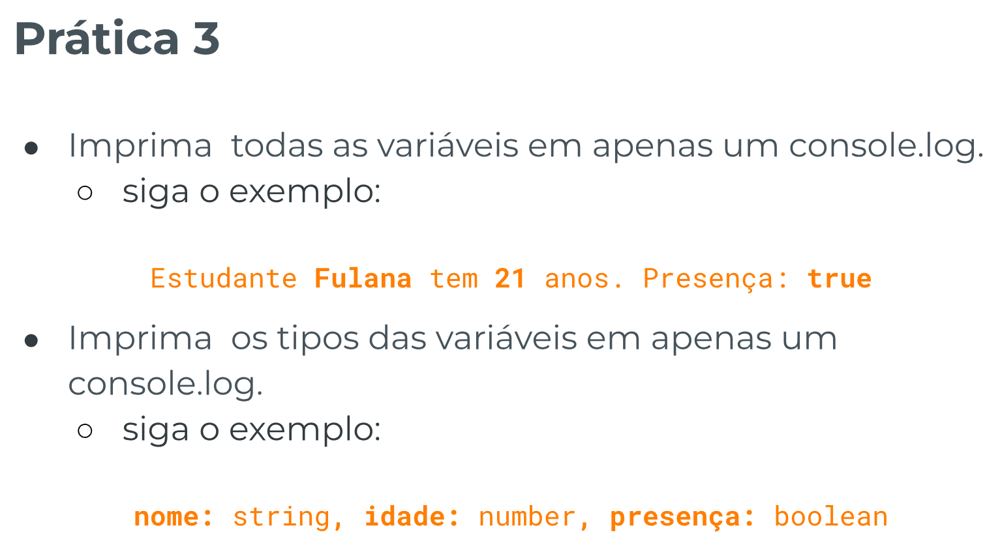

# Operadores - Template de Prática

## Índice

-   [Prática Guiada 1](#prática-guiada-1)

    -   [Enunciado](#enunciado)
    -   [Resolução](#resolução)

-   [Prática Guiada 2](#prática-guiada-2)

    -   [Enunciado](#enunciado-1)
    -   [Resolução](#resoluc3a7c3a3o-1)

-   [Prática Guiada 3](#prática-guiada-3)

    -   [Enunciado](#enunciado-2)
    -   [Resolução](#resoluc3a7c3a3o-2)

## Prática Guiada 1

[Voltar ao Topo](#índice)

### Enunciado





### Resolução

```js
// => PRÁTICAS <=
// 1. PRIMEIRA PRÁTICA
const nome = "Amanda Oliveira Polari de Alcântara";
const nome = prompt("Qual é o seu nome?");
console.log(nome);
console.log(typeof nome) //PROMPT SEMPRE DEVOLVE UMA STRING

nome = "Ana";
console.log(nome);

let idade = 27;
let idade = Number(prompt("Qual é a sua idade?"));
console.log(idade);
console.log(typeof idade) //PROMPT SEMPRE DEVOLVE UMA STRING

idade = 28;
console.log(idade);

Vírgulas se tornam espaços no console.log:
console.log("Olá!", "Meu nome é", nome, "e eu tenho", idade, "anos de idade");
```

## Prática Guiada 2

[Voltar ao Topo](#índice)

### Enunciado



### Resolução

```js
// SEGUNDA PRÁTICA:
//cenário A
let temPet = false;
let nomePet = null;

//cenário B
temPet = true;
nomePet = 'Naive';

// Testando tipo
console.log('Tipo da variável', typeof nome);
console.log('Tipo da variável idade', typeof idade);

console.log(temPet);
console.log(typeof temPet);

console.log(nomePet);
console.log(typeof nomePet);
```

## Prática Guiada 3

[Voltar ao Topo](#índice)

### Enunciado



### Resolução

```js
// TERCEIRA PRÁTICA:

const marcaFoneDeOuvido = 'JBL';
let anosDeUso = 3;
let estadoNovo = false;

// => Melhorando

console.log('Tipo da variável marcaFoneDeOuvido', typeof marcaFoneDeOuvido);

console.log('Tipo da variável anosDeUso', typeof anosDeUso);

console.log('Tipo da variável estadoNovo', typeof estadoNovo);

// -- Antes

// console.log(typeof marcaFoneDeOuvido, typeof anosDeUso, typeof estadoNovo);

// console.log(marcaFoneDeOuvido, anosDeUso, estadoNovo);

console.log(
    'Eu escolhi o objeto fone de ouvido da marca',
    marcaFoneDeOuvido,
    'que possui',
    anosDeUso,
    'anos de uso',
    'e não está em estado novo'
);
```
